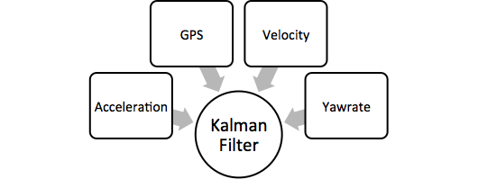
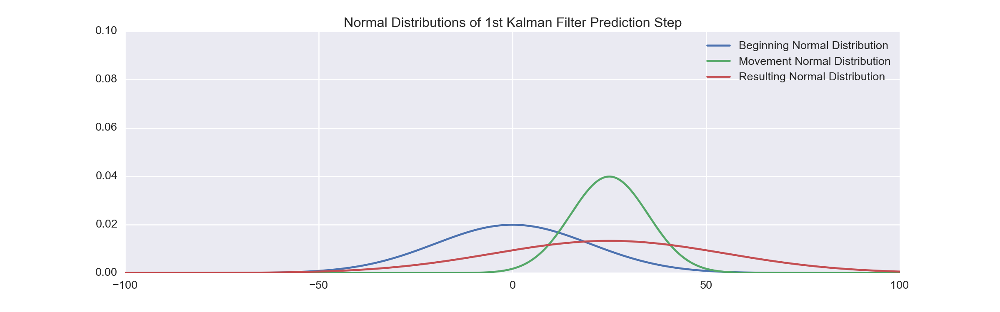

theme: sudodoki/reveal-cleaver-theme
title: PyData Berlin 2014 Talk - IPython and Sympy to Develop a Kalman Filter for Multisensor Data Fusion
author:
  name: Thanks for attention!
  twitter: balzer82
  url: http://balzer82.github.io/Kalman/
output: Presentation.html
controls: true

--


## IPython and Sympy to Develop a Kalman Filter for Multisensor Data Fusion

~ Paul Balzer ~

--

## Setup

`https://github.com/balzer82/PyData-Berlin-2014-Kalman`

~

Package Versions used:
```
Sympy 0.7.4.1
Numpy 1.8.1
Pandas 0.14.0
Matplotlib 1.3.1
IPython 2.1.0
Seaborn 0.3.1
```
~

*Presentation made with cleaver*

-- 
# Prolog

The best filter algorithm to fuse multiple sensor informations is the Kalman filter. To implement it for non-linear dynamic models (e.g. a car), analytic calculations for the matrices are necessary.



This talk will show, how the IPython Notebook and Sympy helps to develop an optimal filter to fuse sensor information from different sources (e.g. IMU yawrate and GPS position) to get an optimal estimate.

--

# Topics
1. Sensor Noise
2. Filter idea in 1D
3. Multi-Dimensional Kalman Filter
4. Extended Kalman Filter

--


### 1. Sensor Noise

A very basic introduction to sensor noise and how to describe them statistically.


See [Sensor-Noise.ipynb](http://localhost:8888/notebooks/Sensor-Noise.ipynb)
--

### 2. Filter idea in 1D

Basic introduction to the theory behind the filter algorithm in just one dimension.



See [Kalman-Filter-1D.ipynb](http://localhost:8888/notebooks/Kalman-Filter-1D.ipynb)

--

### 3. Multi-Dimensional Kalman Filter

Now we are going multi-dimensional with matrices.


See [Kalman-Filter-CV.ipynb](http://localhost:8888/notebooks/Kalman-Filter-CV.ipynb)

--

### 4. Extended Kalman Filter

This is actually a real life example, which fuses GPS measurements and IMU measurements of a real vehicle.


See [Extended-Kalman-Filter-CTRV.ipynb](http://localhost:8888/notebooks/Extended-Kalman-Filter-CTRV.ipynb)
