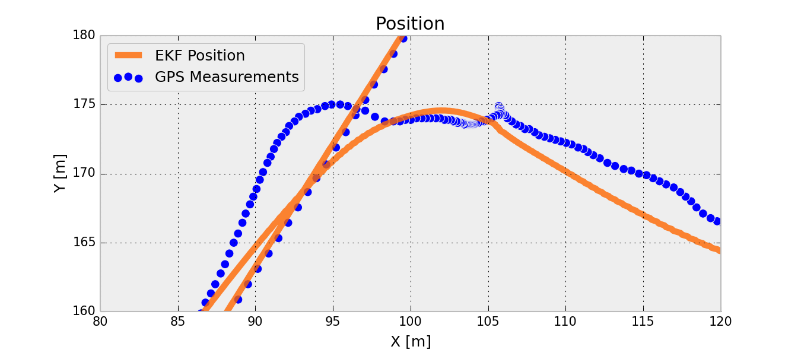
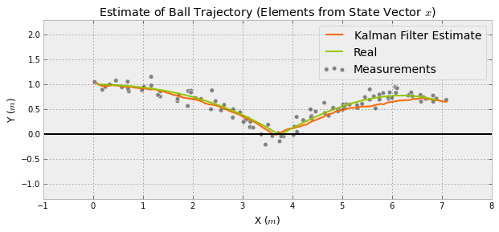

theme: sudodoki/reveal-cleaver-theme
title: PyData Berlin 2014 Talk - IPython and Sympy to Develop a Kalman Filter for Multisensor Data Fusion
author:
  name: Thanks for attention!
  twitter: balzer82
  url: http://balzer82.github.io/Kalman/
output: Presentation.html
controls: true

--


## IPython and Sympy to Develop a Kalman Filter for Multisensor Data Fusion

~ Paul Balzer ~

--

## Setup

`> http://tinyurl.com/PyData-Kalman <`

or
```
git clone https://github.com/balzer82/PyData-Berlin-2014-Kalman
```

~

Package Versions used:
```
Sympy 0.7.4.1
Numpy 1.8.1
Pandas 0.14.1
Matplotlib 1.3.1
IPython 2.1.0
Seaborn 0.3.1
```
~

*Presentation made with cleaver*

-- 
# Prolog


This talk will show you, how the IPython Notebook and Sympy helps to develop an optimal filter to fuse sensor information from different sources (e.g. IMU yawrate and GPS position) to get an optimal estimate.

--

# Today's Goal



A car is driving in the city. Shading > bad GPS Signal quality > Position signal is "jumping". But position estimate could be improved by speed and turn rate measurements.

--

# Topics
1. Sensor Noise
2. Filter idea in 1D
3. Multi-Dimensional Kalman Filter
4. Extended Kalman Filter

--


### 1. Sensor Noise

Believe it or not: No sensor on the whole world is providing the 'real value'. And even if, you do not know, if it is the real value.


`sensor value = real value + some error`

See [Sensor-Noise.ipynb](http://localhost:8888/notebooks/Sensor-Noise.ipynb)
--

### 2. Filter idea in 1D

Basic introduction to the theory behind the filter algorithm in just one dimension.


See [Kalman-Filter-1D.ipynb](http://localhost:8888/notebooks/Kalman-Filter-1D.ipynb)

--

### 3. Multi-Dimensional Kalman Filter

Now we are going multi-dimensional with matrices.



See [Kalman-Filter-CA-Ball.ipynb](http://localhost:8888/notebooks/Kalman-Filter-CA-Ball.ipynb)

--

### 4. Extended Kalman Filter

This is actually a real life example, which fuses GPS measurements and IMU measurements of a real vehicle.


See [Extended-Kalman-Filter-CTRV.ipynb](http://localhost:8888/notebooks/Extended-Kalman-Filter-CTRV.ipynb)
